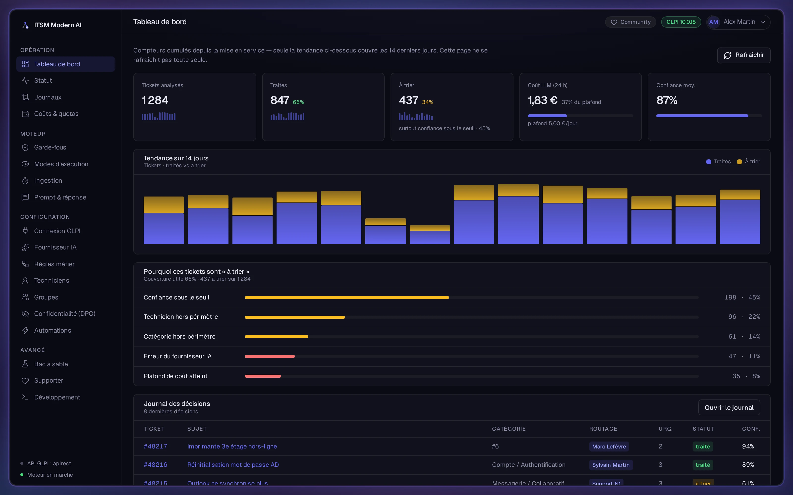
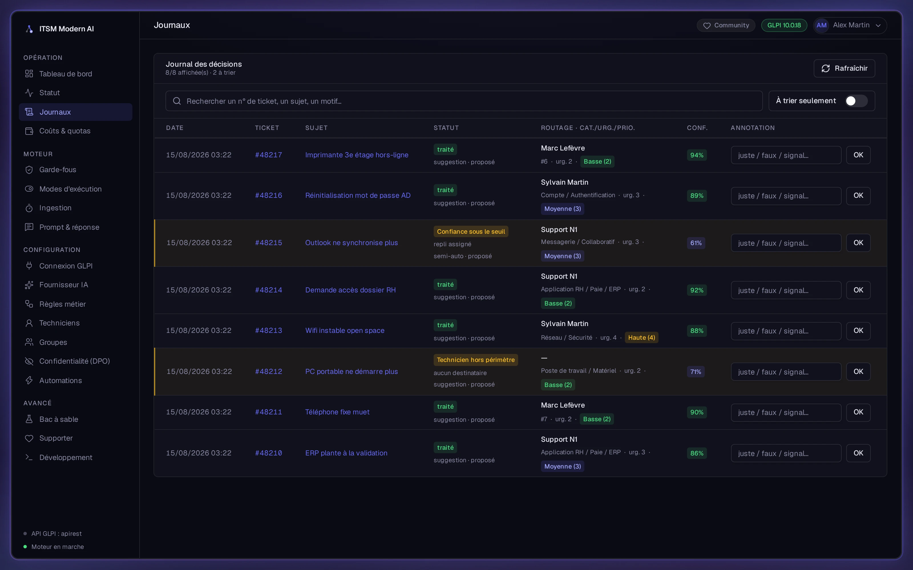
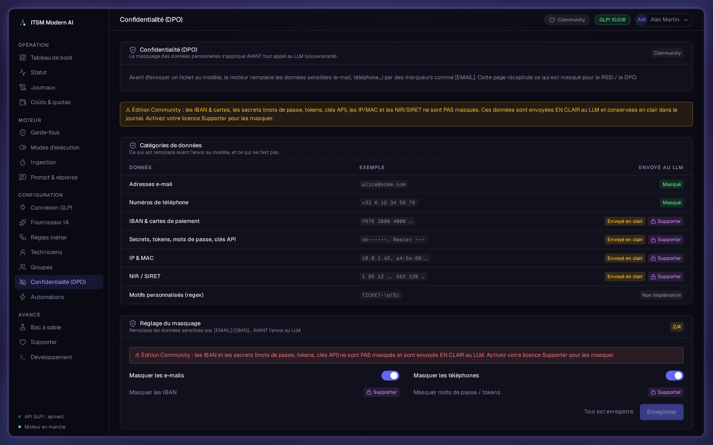
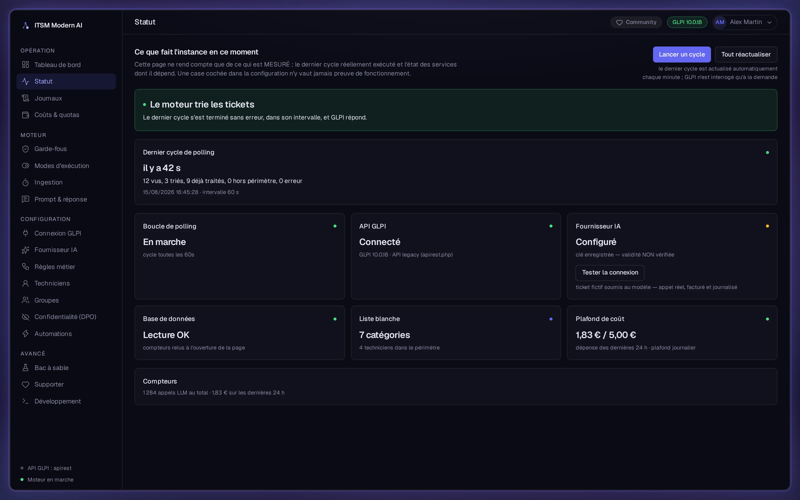

<div align="center">


# ITSM Modern AI

**Triage automatique des tickets GLPI par un LLM, sous contrôle déterministe du code.**
On-premise, souverain, open-core — le modèle propose, le code décide.

*Automated GLPI ticket triage with an LLM kept behind deterministic guardrails.*

[](LICENSE)
[](pyproject.toml)
[](https://github.com/WicaebethTheo/itsm-modern-ai/pkgs/container/itsm-modern-ai)
[](pyproject.toml)

[Démarrage](#démarrage) · [Documentation](https://docs.itsm-modern-ai.com) · [Site produit](https://itsm-modern-ai.com)

</div>



## Fonctionnalités

- **Triage à garde-fous** — proposition du LLM filtrée par liste blanche et seuil de
  confiance, repli « à trier ».
- **Connecteurs GLPI** — API *legacy* (`apirest.php`) et API V2 (OAuth2).
- **Choix du fournisseur LLM** — Mistral EU par défaut, OpenAI, Anthropic, ou Ollama en
  local intégral.
- **Masquage des données personnelles** — email et téléphone toujours masqués avant le LLM ;
  catégories étendues sous licence Supporter.
- **Console DPO** — catalogue des catégories masquées, testeur de masquage, export d'un
  rapport DPO en Markdown.
- **Coûts et quotas** — dépense LLM glissante sur 24 heures face au plafond journalier.
- **Multi-entités** — mode de triage réglable par entité GLPI.
- **Persistance PostgreSQL** — livrée comme service de la stack, avec sauvegarde à chaud
  vérifiée et migrations Alembic appliquées au démarrage.
- **Sécurité par défaut** — conteneur non-root, accès administrateur *fail-closed*,
  limitation de débit sur le login, secrets chiffrés au repos.

## Fonctionnement

```text
 GLPI ──poll──▶ Masquage PII ──▶ LLM (proposition) ──▶ Validation déterministe ──▶ GLPI
                                                       │ whitelist + seuil de confiance
                                                       ▼
                                       sous le seuil / hors liste ─▶ « à trier »
```

Cet ordre n'est jamais réordonné ni court-circuité : aucune action n'atteint GLPI sans être
passée par la validation du code, et un ticket sur lequel le doute subsiste retourne
« à trier » — la seule échappatoire du pipeline.

## Démarrage

Image publique GHCR multi-arch (amd64 + arm64), *pull-only* : ni clone, ni build.

```bash
curl -fsSL https://itsm-modern-ai.com/install | bash
```

Pour Portainer ou un orchestrateur, [`docker-compose.portainer.yml`](docker-compose.portainer.yml)
se colle tel quel, aucune variable obligatoire. La console écoute sur `http://HOTE:8000` et
le premier écran crée le compte administrateur.

> **N'exposez pas le port avant d'avoir créé ce compte.** Tant qu'aucun compte n'existe,
> quiconque atteint le port peut revendiquer l'administration de l'instance : ni jeton
> d'amorçage, ni fenêtre temporelle, par choix délibéré — le prix aurait été un secret à
> transporter. Le moteur le répète dans ses logs à chaque démarrage.

Mise à jour : `docker compose pull && docker compose up -d`, migrations appliquées au
démarrage. Sauvegardez d'abord (`docker compose exec itsm python -m itsm_modern_ai.backup`),
et **jamais `docker compose down -v`** — l'option supprime la clé de chiffrement et les
données.

[Installation](https://docs.itsm-modern-ai.com/quickstart/) ·
[Configuration](https://docs.itsm-modern-ai.com/configuration/) ·
[Production](https://docs.itsm-modern-ai.com/production-deployment/) ·
[Dépannage](https://docs.itsm-modern-ai.com/troubleshooting/)

## Captures

Toute instance sert un **mode démo** sur `/demo` : mêmes écrans, données entièrement
simulées, aucun GLPI ni clé LLM requis. Les captures ci-dessous en sortent
([`frontend/scripts/screenshots.mjs`](frontend/scripts/screenshots.mjs)).

**Journal des décisions** — chaque décision tracée, avec son motif de repli quand elle n'a
pas été appliquée.



**Confidentialité (DPO)** — ce qui est masqué avant l'appel au modèle, et ce qui ne l'est pas.



**Statut** — ce que l'instance fait réellement : dernier cycle mesuré, état des services dont
elle dépend.



## Sécurité et souveraineté

**Sorties réseau.** Hors du fournisseur LLM configuré et de votre GLPI, la seule sortie est
la vérification de version : best-effort, elle lit uniquement le dernier numéro publié sur
`api.github.com` et n'envoie aucune donnée de l'instance. `UPDATE_CHECK_URL=` vide la
désactive. La licence Supporter est vérifiée hors-ligne (Ed25519), sans serveur de licence.

**Masquage.** Email et téléphone sont masqués avant l'appel au LLM. IBAN et cartes, secrets
(mots de passe, jetons, clés d'API), IP et MAC, identifiants NIR / SIRET sont débloqués par
une licence Supporter — **sans licence, ils partent en clair au LLM**, ce que la console et
le rapport DPO affichent l'un comme l'autre plutôt que de le taire.

**Secrets et accès.** Chiffrement Fernet au repos, `master.key` en `0600` dans son volume ;
conteneur non-root, administration *fail-closed*, limitation de débit sur le login. Aucune
métrique nominative par technicien : le produit ne mesure pas les personnes. Export CSV pour
la DPO et purge RGPD automatisée.

Détail et limites connues : [Sécurité & limites](https://docs.itsm-modern-ai.com/security-limits/).

## Éditions

Édition unique : un seul dépôt, une seule image, tout le code sous licence MIT — y compris
les fonctions Supporter, dont le code est livré mais verrouillé. Elles se déverrouillent en
place, par une clé signée en Ed25519 vérifiée hors-ligne : collez-la dans la page Supporter
de la console, sans changement d'image ni perte de données. La retirer revient à l'édition
Community.

[docs.itsm-modern-ai.com/supporter](https://docs.itsm-modern-ai.com/supporter/)

## Licence

[MIT](LICENSE). Le modèle est open-core : tout le code applicatif est public dans ce dépôt,
la monétisation passe par le service — support avec SLA, installation et configuration,
prestations, licences Supporter. Seule la clé privée de signature des licences reste hors
dépôt.
