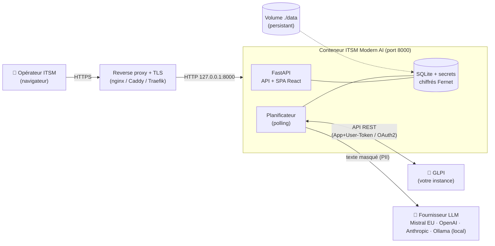
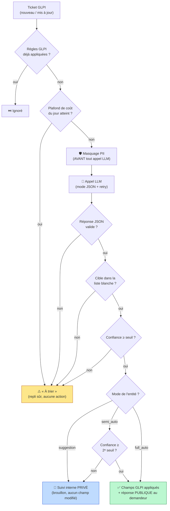
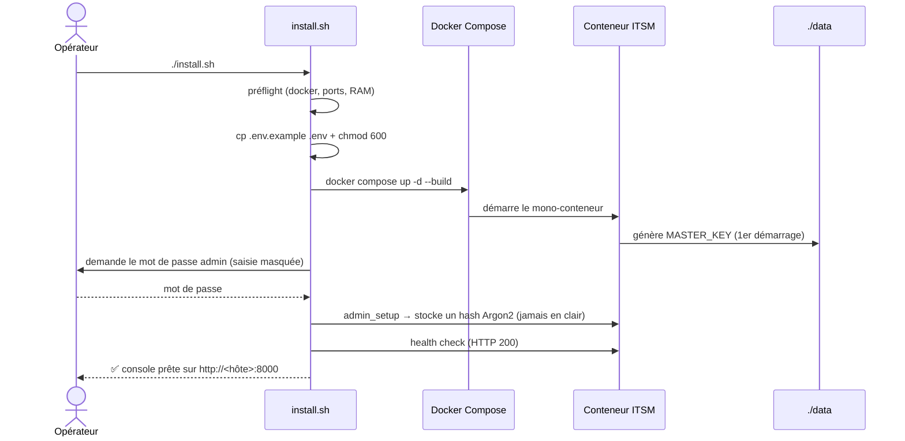
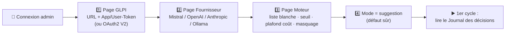
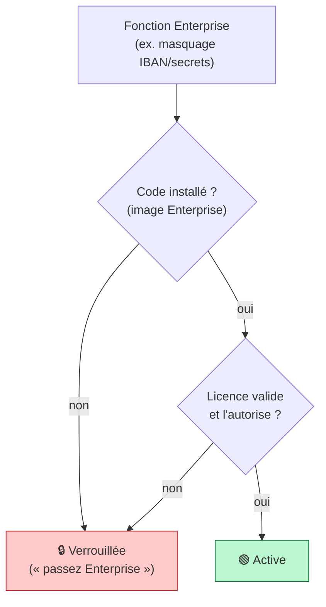
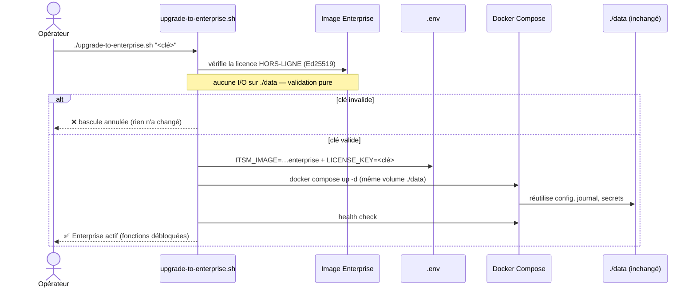
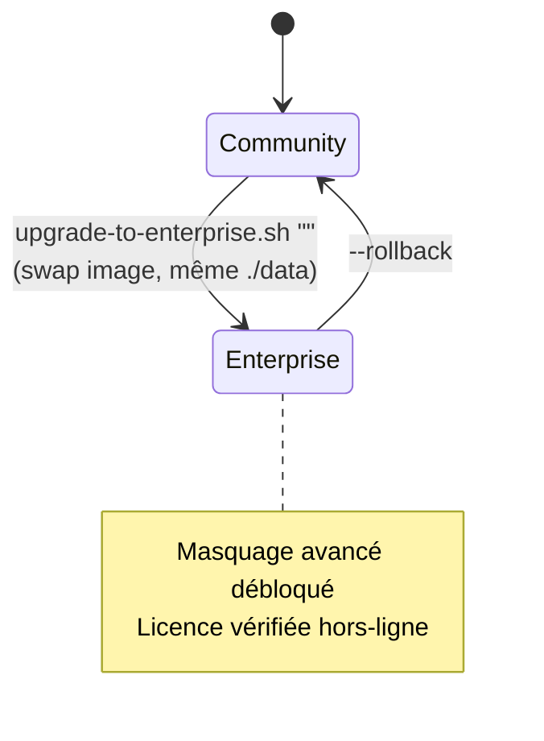

# Guide de fonctionnement — ITSM Modern AI

**Installation chez le client, fonctionnement du moteur, et passage en édition Enterprise.**

ITSM Modern AI est un **moteur de triage IA des tickets GLPI**, *on-premise* et souverain.
Principe non négociable : **le LLM propose, le code valide et décide.** Le modèle ne reçoit
jamais les clés de votre GLPI ; chaque action est bornée par du code déterministe.

- **Mono-conteneur** : Python/FastAPI sert l'API **et** l'UI React sur le port `8000`.
- **Aucune dépendance lourde** : base **SQLite** + secrets chiffrés (Fernet) dans le volume `./data`. Pas de Postgres, pas de Redis requis.
- **Open-core** : édition **Community** (gratuite, MIT) ; édition **Enterprise** (licence Ed25519 hors-ligne) qui débloque des fonctions avancées — **sans réinstallation**.

---

## 1. Architecture d'ensemble



**À retenir :**
- Le conteneur n'est **jamais** exposé directement : on le place derrière un reverse proxy qui termine le TLS (le conteneur écoute en loopback / réseau privé).
- Les secrets (tokens GLPI, clé API LLM) sont saisis **dans la console**, jamais dans `.env`, et stockés **chiffrés** dans `./data`.
- Avec **Ollama**, aucune donnée ne quitte votre réseau.

---

## 2. Le pipeline de triage (ordre immuable)

Pour chaque ticket nouveau ou mis à jour, le moteur exécute **toujours** la même séquence.
Le LLM n'intervient qu'au milieu, et sa sortie est **revalidée par du code**.



**Garde-fous (le « code décide ») :**
- **Liste blanche déterministe** : une cible hors de l'ensemble autorisé est rejetée → « à trier ».
- **Seuil de confiance** : sous le seuil, rien n'est appliqué.
- **« À trier »** est la **seule** échappatoire : en cas de doute, le moteur ne fait rien de risqué.
- Le brouillon LLM est **échappé (HTML)** et **re-masqué** avant toute publication publique.

> **Masquage PII selon l'édition :** Community masque **e-mail + téléphone**. L'édition
> Enterprise débloque **IBAN/cartes, IP/MAC, secrets (mots de passe/tokens/clés), NIR/SIRET**.

---

## 3. Installation chez le client

### Pré-requis
- **Docker Engine** + **Compose v2** (`docker compose version`).
- Une instance **GLPI** joignable (API REST legacy `apirest.php` activée, ou API V2 OAuth2 en Beta).
- Une clé **Mistral** (défaut souverain UE), une autre clé cloud supportée, **ou** **Ollama** local.
- ~1 Go de disque libre.

### Procédure (voie recommandée : `install.sh`)

```bash
git clone https://github.com/tmeneboode/itsm-modern-ai.git
cd itsm-modern-ai
./install.sh          # préflight + .env + build + démarrage + mot de passe admin
```



**Points de sécurité importants :**
- `MASTER_KEY` est **générée au premier démarrage dans `./data`** (ne pas la mettre dans `.env` en pilote ; en production, on peut la gérer hors-bande).
- Le mot de passe admin est saisi de façon interactive et stocké en **hash Argon2**. **Fail-closed** : sans identifiant configuré, les endpoints admin répondent **401** (jamais ouverts).
- `install.sh` pose `chmod 600` sur `.env`.

### Configuration depuis la console (étape humaine, une fois)



> **Démarrer sans risque :** restez en mode **suggestion** (aucune écriture, suivi privé)
> tant que vous n'avez pas relu assez de décisions pour faire confiance. Pour un essai
> sans **aucune** écriture GLPI, utilisez le **Bac à sable** (`/api/sandbox`).

### Mise en production
- Toujours derrière un **reverse proxy + TLS** (le conteneur n'est pas exposé en direct).
- Sauvegarder le volume **`./data`** (config, journal, secrets chiffrés) **et** `MASTER_KEY` séparément. *Perdre `MASTER_KEY` ou `./data` = secrets irrécupérables.*
- Mise à jour : `./update.sh` (sauvegarde `./data` d'abord) ou `git pull && docker compose up -d --build`.

---

## 4. Éditions : Community vs Enterprise

Une fonction payante est **active** uniquement si **(1) son code est présent** (image Enterprise)
**ET (2) la licence l'autorise**. Sur l'image Community, le code n'est pas là → tout reste
verrouillé même avec une clé valide.



| Capacité | Community | Enterprise |
|---|:---:|:---:|
| Triage IA à garde-fous, modes suggestion/semi/full | ✅ | ✅ |
| Masquage PII e-mail + téléphone | ✅ | ✅ |
| Masquage **IBAN/cartes, IP/MAC, secrets, NIR/SIRET** | ❌ | ✅ |
| Vérification licence **hors-ligne** (Ed25519, air-gap) | — | ✅ |

> La licence est un **jeton signé Ed25519**, vérifié **100 % hors-ligne** (aucun appel
> sortant, compatible air-gap). Pas de « phone-home ».

---

## 5. Passage en Enterprise (sans réinstallation)

Le modèle open-core ne crée **pas** un second déploiement : on garde **le même `./data`**
et on **remplace l'image**. La bascule est réversible.

```bash
# 1) Récupérer l'image Enterprise (registre privé, ou archive hors-ligne)
#    puis, dans le dossier du déploiement :
./upgrade-to-enterprise.sh "<clé-de-licence>"
#    variante air-gap : ./upgrade-to-enterprise.sh "<clé>" image.tar
```



**Garanties de la bascule :**
- **Données conservées** : même volume `./data` → aucune reconfiguration, aucun secret à ressaisir.
- **Sûre** : la licence est validée **avant** tout changement ; une clé invalide annule la bascule sans rien modifier.
- **Réversible** : retour à Community à tout moment —

  ```bash
  ./upgrade-to-enterprise.sh --rollback   # remet ITSM_IMAGE / LICENSE_KEY à vide
  ```



---

## 6. Souveraineté & confidentialité (résumé)

- **Hébergement** : 100 % chez vous (mono-conteneur). Aucun backend éditeur dont vous dépendez.
- **Données** : avec Ollama, le contenu ne quitte **jamais** votre réseau ; avec Mistral, il reste sur une infrastructure **UE**.
- **Masquage PII** appliqué **avant** tout appel LLM (portée selon l'édition).
- **Zéro phone-home** par défaut ; vérification de mise à jour **opt-in** ; licence **hors-ligne**.
- **Auditable** : chaque décision est journalisée (entrées masquées, réponse, validation, action).

> ⚠️ Le moteur fournit des **garde-fous**, pas une garantie absolue. La sécurisation du
> déploiement (durcissement de l'hôte, TLS, revue des décisions, choix du fournisseur)
> reste de la responsabilité de l'exploitant.
