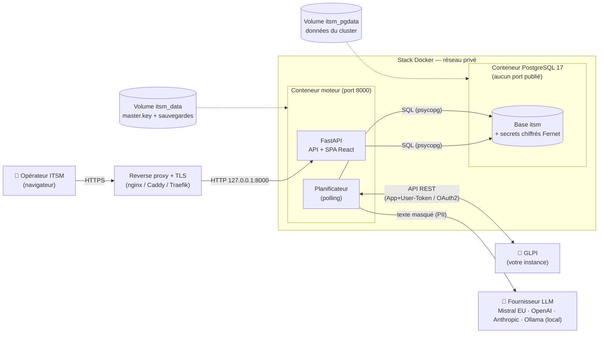
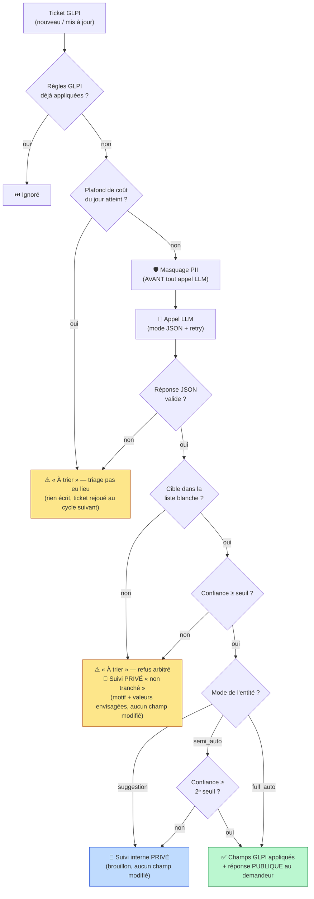
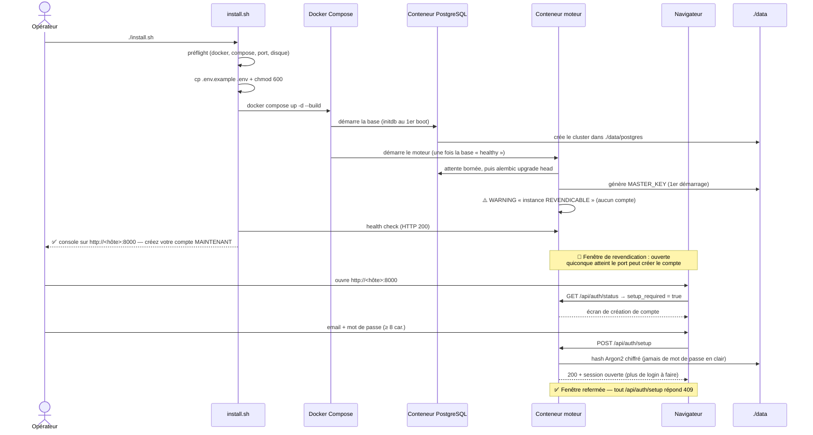
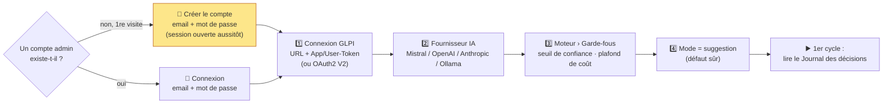
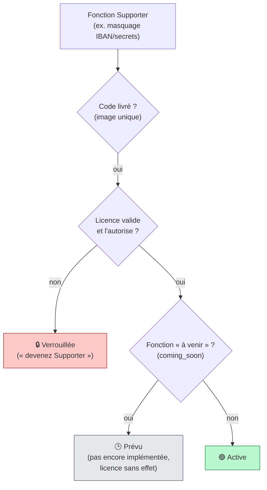
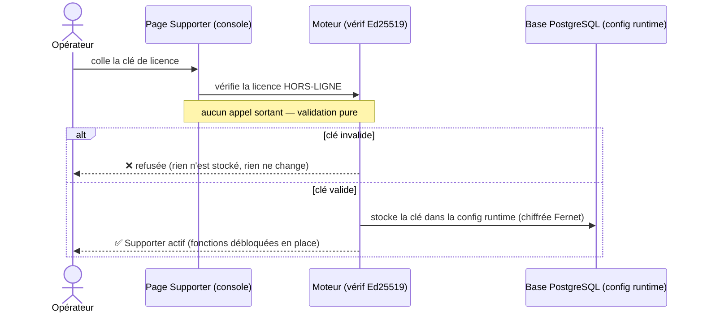
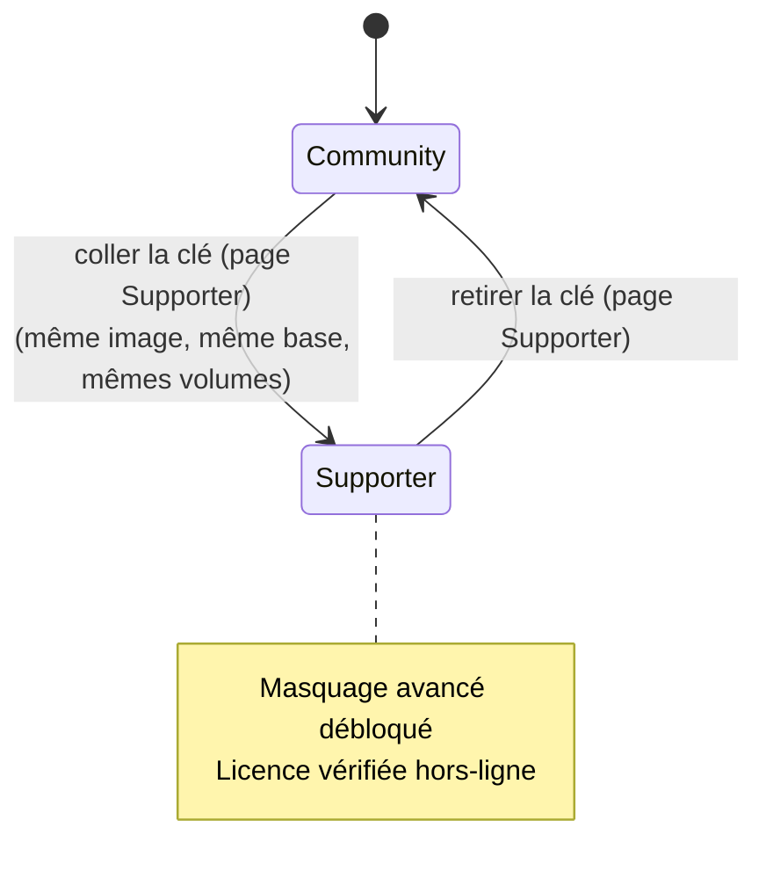

# Guide de fonctionnement — ITSM Modern AI

Installation chez le client, fonctionnement du moteur, et activation des fonctions Supporter.

ITSM Modern AI est un moteur de triage IA des tickets GLPI, *on-premise* et souverain.
Principe non négociable : le LLM propose, le code valide et décide. Le modèle ne reçoit
jamais les clés de votre GLPI ; chaque action est bornée par du code déterministe.

- **Un seul conteneur applicatif** : Python/FastAPI sert l'API et l'UI React sur le port `8000`. Aucun serveur Node au runtime.
- **Deux conteneurs au total** : le moteur et sa base PostgreSQL, seule base supportée. Ce que coûte la base : un conteneur de plus à superviser, ~250 Mio de RAM réservés pour lui (dimensionner à ~1,5 Gio pour la stack), deux volumes à sauvegarder ensemble, et une majeure PostgreSQL épinglée (17) qu'il faudra migrer un jour par `pg_dump`/`pg_restore`. Rien d'autre en revanche : pas de Redis, pas de broker, pas de service externe. Détail des contreparties : [`docs/postgresql.md`](postgresql.md).
- **Secrets chiffrés** (Fernet) : la `master.key` vit dans le volume applicatif, les données dans celui de la base.
- **Open-core (édition unique)** : tout le code est livré dans une seule image (MIT) ; une licence Supporter (Ed25519 hors-ligne) débloque en place des fonctions avancées, sans réinstallation ni swap d'image.

---

## 1. Architecture d'ensemble



**À retenir :**
- Le moteur n'est jamais exposé directement : on le place derrière un reverse proxy qui termine le TLS (le conteneur écoute en loopback / réseau privé).
- La base ne publie aucun port : elle n'est joignable que depuis le réseau de la stack. L'exposer sur l'hôte n'offrirait qu'un service d'authentification de plus à un attaquant.
- **Deux volumes, deux rôles.** `itsm_data` porte la `master.key` (et les sauvegardes) ; `itsm_pgdata` porte les données. L'un sans l'autre ne restaure rien : sans la clé, la base est illisible. Depuis les sources, ces deux volumes sont deux dossiers, `./data` et `./data/postgres`.
- Les secrets (tokens GLPI, clé API LLM) sont saisis dans la console, jamais dans `.env`, et stockés chiffrés en base.
- Avec Ollama, aucune donnée ne quitte votre réseau.

---

## 2. Le pipeline de triage (ordre immuable)

Pour chaque ticket nouveau ou mis à jour, le moteur exécute toujours la même séquence.
Le LLM n'intervient qu'au milieu, et sa sortie est revalidée par du code.



**Garde-fous (le « code décide ») :**
- **Liste blanche déterministe** : une cible hors de l'ensemble autorisé est rejetée → « à trier ».
- **Seuil de confiance** : sous le seuil, rien n'est appliqué.
- « À trier » est la seule échappatoire : en cas de doute, le moteur ne fait rien de risqué.
- Un refus arbitré (liste blanche / seuil) dépose un Suivi privé « non tranché » : le technicien voit le motif et ce que l'IA envisageait, sans qu'aucun champ n'ait bougé et sans brouillon à recopier. Le ticket cesse d'être indistinguable d'un ticket que personne n'a ouvert. Une panne (LLM injoignable, plafond atteint) n'écrit rien : le ticket est simplement rejoué.
- Le brouillon LLM est échappé (HTML) et re-masqué avant toute publication publique.

> **Masquage PII selon la licence :** sans licence, on masque e-mail + téléphone. Une
> licence Supporter débloque IBAN/cartes, IP/MAC, secrets (mots de passe/tokens/clés), NIR/SIRET.

---

## 3. Installation chez le client

### Pré-requis
- Docker Engine et Compose v2 (`docker compose version`).
- Une instance GLPI joignable (API REST legacy `apirest.php` activée, ou API V2 OAuth2 en Beta).
- Une clé Mistral (défaut souverain UE), une autre clé cloud supportée, ou Ollama local.
- ~1,5 Gio de RAM et ~2 Gio de disque libre (réservations : 128 Mio pour le moteur, 256 Mio pour la base ; plafonds : 512 Mio et 1 Gio).
- Rien à installer côté base : le service PostgreSQL fait partie de la stack. En airgap, penser à transférer aussi l'image `postgres:17-alpine` (cf. [`install.md`](install.md#depuis-les-sources--hors-ligne-airgap-build-local)).

### Procédure (voie recommandée : image GHCR « pull-only »)

L'exploitant ne clone ni ne build rien : on tire l'image publique pré-construite
`ghcr.io/wicaebeththeo/itsm-modern-ai:latest`. Trois voies (détails dans
[`docs/install.md`](install.md)) :

```bash
# (a) One-liner — écrit le compose + .env, tire l'image, démarre :
curl -fsSL https://itsm-modern-ai.com/install | bash

# (b) Portainer / orchestrateur : coller docker-compose.portainer.yml
#     puis Deploy. Aucune variable obligatoire.

# (c) docker run durci : réseau dédié + conteneur postgres:17-alpine +
#     deux volumes (itsm_data, itsm_pgdata).
```

Il n'y a aucun mot de passe à préparer : à la première visite de la console, l'exploitant
crée son compte administrateur (email + mot de passe, ≥ 8 caractères) et la session s'ouvre
dans la foulée. Le moteur ne lit plus aucun mot de passe dans l'environnement.

> ### ⚠️ Ce qu'il faut dire au client avant qu'il déploie
> Entre le démarrage du conteneur et la création du compte, quiconque atteint le port peut
> revendiquer l'administration de l'instance. Ni jeton d'amorçage ni fenêtre temporelle ne
> sont posés : c'est un choix délibéré, au profit de la simplicité (les deux auraient
> réintroduit un secret à transporter).
>
> Conséquence pratique : ne pas exposer le port publiquement avant d'avoir créé le compte.
> Déployer port fermé ou sur réseau interne, créer le compte, puis publier.
>
> Tant que le compte n'existe pas, le moteur journalise à chaque démarrage
> `AUCUN COMPTE ADMINISTRATEUR : cette instance est REVENDICABLE …`. Cet avertissement est le
> signal à surveiller : s'il disparaît sans que personne de l'équipe n'ait créé le compte,
> l'instance a été prise, et il faut repartir d'une base vierge.
>
> Déploiement sur un réseau non maîtrisé ? Le compte peut être créé en CLI, juste après le
> `up -d`, avant même d'ouvrir la console :
> `docker compose exec itsm python -m itsm_modern_ai.admin_setup --email vous@exemple.fr`

> La voie `install.sh` (clone + build local) reste valide pour l'airgap / hors-ligne.
> Le schéma ci-dessous illustre ce parcours depuis les sources :
>
> ```bash
> git clone https://github.com/WicaebethTheo/itsm-modern-ai.git
> cd itsm-modern-ai
> ./install.sh          # préflight + .env + build + démarrage (pas de mot de passe demandé)
> ```



**Points de sécurité importants :**
- `MASTER_KEY` est générée au premier démarrage dans `./data` (ne pas la mettre dans `.env` en pilote ; en production, on peut la gérer hors-bande).
- Le compte admin est créé dans le navigateur et stocké en hash Argon2 (lui-même chiffré). Aucun mot de passe ne transite par `.env`, l'environnement du conteneur ou l'historique du shell.
- **Fail-closed** : tant qu'aucun compte n'existe, les endpoints admin répondent 401 (jamais ouverts) ; une fois créé, `POST /api/auth/setup` répond 409 et ne peut plus écraser le compte en place. Cette route publique est comptée par le même rate-limit que le login.
- La fenêtre entre les deux notes du schéma est le risque assumé : elle doit être la plus courte possible, et le port ne doit pas être public pendant ce temps.
- **Changer son mot de passe, connecté** : page **Compte & sécurité**, ouverte depuis le menu de compte en haut à droite (elle n'est pas dans le menu latéral), carte « Changer le mot de passe », qui redemande le mot de passe actuel et referme toutes les sessions. L'adresse et le nom affiché, eux, restent du ressort de la CLI (`admin_setup --email … --email-only`).
- **Mot de passe oublié** : aucun email de réinitialisation (aucun SMTP, par souveraineté). Plus de session, donc plus d'accès à la page ci-dessus : seul chemin, `docker compose exec itsm python -m itsm_modern_ai.admin_setup --force`, ou `./install.sh --reset-password` depuis les sources. L'accès shell à l'hôte est donc le facteur d'authentification de dernier recours.
- `install.sh` pose `chmod 600` sur `.env`.

### Configuration depuis la console (étape humaine, une fois)



> L'étape 👤 n'arrive qu'une fois, et il faut la faire tout de suite après le déploiement :
> tant qu'elle n'a pas eu lieu, n'importe qui atteignant le port peut la faire à votre
> place.

> **Démarrer sans risque :** restez en mode suggestion (aucune écriture, suivi privé)
> tant que vous n'avez pas relu assez de décisions pour faire confiance. Pour un essai
> sans aucune écriture GLPI, utilisez le **Bac à sable** (`/api/sandbox`).

#### Ne pas attendre pour savoir si ça marche

Deux boutons évitent de configurer à l'aveugle puis d'attendre le prochain cycle :

- **Tester le fournisseur** (page Fournisseur IA) soumet un ticket de test au modèle et
  vérifie que la Décision renvoyée est exploitable. Il distingue « le fournisseur ne
  répond pas » de « il répond, mais pas une Décision valide » — ce second cas laisse le
  moteur tourner sans erreur apparente en envoyant tous les tickets « à trier », et il se
  corrige en changeant de modèle, pas de clé.
- **Lancer un cycle** (page Statut) exécute immédiatement un cycle de polling, celui du
  scheduler, gardes comprises. Il ne contourne pas la pause du polling : celle-ci reste
  l'arrêt d'urgence du moteur.

### Mise en production
- Toujours derrière un reverse proxy + TLS (le moteur n'est pas exposé en direct).
- Changer le mot de passe de la base avant le tout premier démarrage (`POSTGRES_PASSWORD` et `ITSM_DATABASE_URL`, mêmes valeurs). Ensuite, il faudrait un `ALTER USER`.
- **Sauvegarder avec la commande livrée**, et non en copiant des fichiers : `docker compose exec itsm python -m itsm_modern_ai.backup` produit un dump `pg_dump` vérifié + la `master.key`, et sort en erreur plutôt que de laisser une sauvegarde douteuse. Copier `data/postgres` d'un serveur en marche produit un cluster incohérent, qu'on ne découvre irrécupérable que le jour de la restauration. *Perdre `MASTER_KEY` = secrets irrécupérables, même avec la base.*
- **Sortir les sauvegardes de l'hôte** : elles sont écrites dans le volume, qu'un incident emporte avec elles.
- Mise à jour (image GHCR) : `docker compose pull && docker compose up -d` (migrations auto, volumes `itsm_data` et `itsm_pgdata` préservés ; jamais `docker compose down -v`). Voie sources : relancer `./install.sh` (menu **Mettre à jour / Réinstaller**, sauvegarde automatique et bloquante incluse) ; non-interactif : `./install.sh --update` ; retour arrière complet : `./install.sh --rollback [horodatage]` (il écrase la base : il faut taper l'horodatage pour confirmer, `Entrée` et `--yes` ne suffisent pas, et sans terminal il faut le déclarer par `ITSM_ROLLBACK_CONFIRME=<horodatage>`).
- ⚠️ Ne bumpez jamais la majeure PostgreSQL « pour être à jour ». Le tag `postgres:17-alpine` reçoit les correctifs mineurs et de sécurité : la laisser figée ne revient pas à rester sans correctifs. En revanche, le répertoire de données d'un cluster 17 est illisible par une majeure supérieure : le conteneur refuserait de démarrer et boucherait en restart. Passer à 18+ est une opération planifiée : dumper, recréer le cluster, restaurer, et faire suivre le client `postgresql-client-17` de l'image du moteur (les deux majeures bougent ensemble). Procédure : [`docs/postgresql.md`](postgresql.md#6-la-majeure-17-est-épinglée).

---

## 4. Fonctions Supporter : verrouillé vs actif

Le code des fonctions Supporter est livré dans l'image unique (toujours `installed`).
Une fonction est active si la licence l'autorise (`entitled`) et si elle n'est pas
annoncée comme « à venir » (`coming_soon`), soit
`active = installed ∧ entitled ∧ ¬coming_soon` (`api/routes/license.py`).

Ce troisième terme n'est pas un détail de code : deux des trois fonctions du catalogue,
**Multi-entités avancé** et **Exports planifiés / DPO+**, sont marquées `coming_soon` dans
`domain/licensing.py`. Une licence qui les couvre ne change donc rien à leur comportement ;
elles s'affichent « Prévu » sur la page Supporter, jamais « Débloqué ». Seule
**Masquage PII avancé** est réellement activable aujourd'hui. L'invariant `coming_soon`
⇒ jamais `active` est verrouillé par un test.



| Capacité | Sans licence (Community) | Avec licence Supporter |
|---|:---:|:---:|
| Triage IA à garde-fous, modes suggestion/semi/full | ✅ | ✅ |
| Masquage PII e-mail + téléphone | ✅ | ✅ |
| Masquage **IBAN/cartes, IP/MAC, secrets, NIR/SIRET** | ❌ | ✅ |
| Vérification licence **hors-ligne** (Ed25519, air-gap) | — | ✅ |

> La licence est un jeton signé Ed25519, vérifié 100 % hors-ligne : sa validation n'émet
> aucun appel sortant (pas de serveur de licence), compatible air-gap.

---

## 5. Devenir Supporter (depuis la page Supporter)

Édition unique : pas de second déploiement, pas de swap d'image. On garde la même image,
la même base et la même `master.key` ; on colle une clé de licence dans la page Supporter
de la console. Réversible : retirer la clé sur cette même page revient à Community.

1. Ouvrez la console et allez sur la page **Supporter**.
2. Collez la clé de licence (`itsm-lic.v1.…`) et validez.
3. La clé est vérifiée hors-ligne (Ed25519). Valide → les fonctions s'activent en place.



**Garanties :**
- **Données conservées** : même base, même `master.key`, mêmes volumes → aucune reconfiguration, aucun secret à ressaisir. Aucune migration de schéma : les fonctions Supporter n'ajoutent aucune table.
- **Sûre** : la licence est validée avant stockage ; une clé invalide n'est pas enregistrée.
- **Réversible** : retirez la clé sur la page Supporter → re-verrouillage immédiat (retour Community).

> **Pré-amorçage optionnel** : pour livrer une instance déjà licenciée (déploiement
> automatisé), définissez `LICENSE_KEY=itsm-lic.v1.…` dans `.env` avant le premier démarrage.
> La page Supporter reste la méthode normale.



---

## 6. Souveraineté & confidentialité (résumé)

- **Hébergement** : 100 % chez vous (moteur + base, rien d'autre). Aucun backend éditeur dont vous dépendez.
- **Données** : avec Ollama, le contenu ne quitte jamais votre réseau ; avec Mistral, il reste sur une infrastructure UE.
- **Masquage PII** appliqué avant tout appel LLM (portée selon la licence).
- **Sorties réseau** : le fournisseur LLM configuré, votre GLPI, et une seule sortie
  supplémentaire, la vérification de version, activée par défaut (opt-out) :
  elle lit uniquement le dernier numéro de version publié sur `api.github.com`,
  sans transmettre aucune donnée, en cache, et seulement quand un admin connecté
  ouvre la console. `UPDATE_CHECK_URL=` vide dans `.env` la coupe (air-gap total).
- **Licence vérifiée hors-ligne** (Ed25519) : aucun serveur de licence, aucun appel sortant.
- **Auditable** : chaque décision est journalisée (entrées masquées, réponse, validation, action).

> ⚠️ Le moteur fournit des garde-fous, pas une garantie absolue. La sécurisation du
> déploiement (durcissement de l'hôte, TLS, revue des décisions, choix du fournisseur)
> reste de la responsabilité de l'exploitant.
